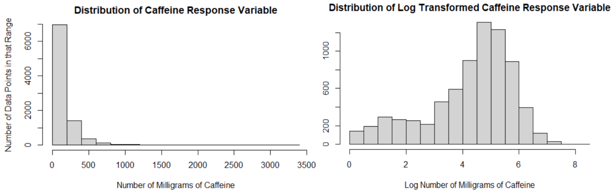
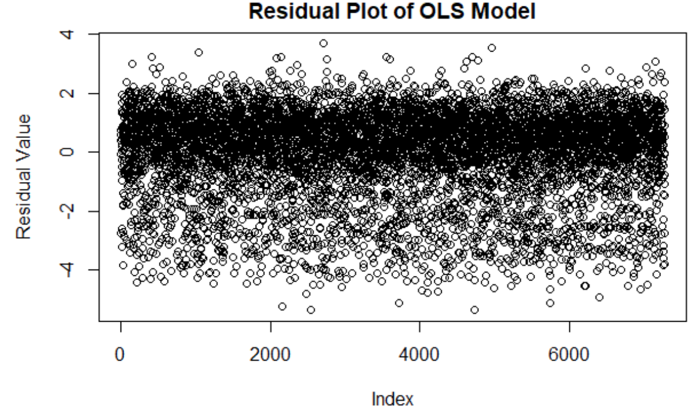

```{r setup, include=FALSE}
knitr::opts_chunk$set(echo = TRUE)
```

# 1 Introduction

Throughout the semester, we have learned many methods regarding statistical learning, which we apply in this culminating final project. This project is broken into two sections: the Regression Problem, and the Classification Problem. For each of the sections, we use responses from the 2009-2017 National Health and Nutrition Examination Survey, made public by the CDC. Note, different sections will use different subsets of the data. For our Regression Problem, we have elected to use the data to analyze how various factors, both demographic and biological, affect caffeine intake. For our Classification Problem, we aim to classify subjects who must eat a special diet, also based on biological data.


### 1.1 Data Preparation

After downloading the separate data files from the CDC website, we consolidated them into one large dataset with 8921 rows and 149 columns, with additional subsets, breaking the data down into years.  We drop missing data later on, as more specific columns of the data are more relevant to the regression and classification problem, separately. In this way, we can maximize the amount of data we use for each individual use. We also do more variable transformations and additions specific to each problem, which can be found in each subsection on data.


# 2 Regression Problem

### 2.1 Introduction

Consuming caffeine has increasingly become an integral part of numerous lives, especially within the United States. However, with the exceptional diversity within the United States, variations of caffeine consumption between different groups of people exist: from age to race and other factors. In fact, society  associates different archetypes of people with surprising specific caffeinated drinks.

Going forward, the amount of caffeine  will be investigated to understand how consumption varies among different demographics. We will analyze which demographic data lends itself to be the most important in regards to caffeine consumption. 


### 2.2 Data

The data was reduced into one response (amount of caffeine consumed in milligrams) and six predictors related to demographics: age, gender, race, annual household income, education level, and citizenship status. After subsetting the data, categorical variables were examined to search for unexplained skewed distributions. The only category that was drastically skewed was the citizenship status data (with eighty-seven percent of respondents being citizens of the United States). Because the majority of individuals in the USA are citizens, this is a reasonable difference. Therefore, the skewed distribution is not a concern. Subsequently,  the  numerical data was inspected and  it was discovered that the distribution for age was approximately uniform.

Additionally, the response variable does not mirror a gaussian distribution. After a log transformation, the variable  distribution was approximately normal with  12,744 data points (fig. 1, below). Therefore, for all ensuing models, the transformed caffeine variable was utilized.



For each model, detailed below, there was a training and test dataset, with 30% of the data in the test set and 70% in the training set. The training set was utilized to train the different models where the test set revealed the testing error as well as $R^2$ value.

### 2.3 Models and Results

*Ordinary Least Squares Regression*

Because the underlying relationship between the response and predictor variables is unlikely linear, this model will not perform as well in terms of test error. However, Ordinary Least Squares provides excellent interpretability. Compared to alternative model architectures, linear regression ascertains the relationship between a specific predictor and response well, considering normality exists. The regression model is decided utilizing forward and backward selection (both methodologies chose the same model). Therefore, the model for linear regression involved the following predictors, age, gender, race, household income, and education status. Afterwards, the residuals were plotted to ensure the model followed the normality assumption. However, as evidenced by fig. 2, the normality assumption was violated: the residuals are not distributed evenly vertically. Therefore, ordinary least squares regression was not viable, and a resistant method would perform better.



*Lasso Regression*

Lasso is a robust model compared to ordinary least squares regression. This model architecture also performs indirectly feature selection which informs which variables hold a relationship to coffee consumption. 

This model concluded that age is positively associated with caffeine consumption. In other words, given all other variables held constant, an older individual drinks more milligrams of coffee than a younger individual. Furthermore, this model established that women had a decrease in coffee consumption. Additionally, there existed various levels of positive or negative effects for each race; Non-Hispanic Whites had the strongest positive effect and Non-Hispanic Black had the strongest negative effect. According to the model citizenship status was mostly negligible with only people who do not know their citizenship status having a nonzero effect. However, this could be due to the fact that there are so few people (0.03%) who do not know their citizenship status within this dataset. Finally, despite the majority of coefficients having smaller effects on caffeine consumption, the coefficient for  people who made under twenty thousand dollars a year had an especially large positive effect on caffeine consumption.

Through ten-fold cross-validation, the ideal penalization term was computed and the model was trained. The model had a test error of 2.19 with an adjusted $R^2$ of 0.11. However, because of the low R2 and relatively high cross-validation score, even if the model will lead to less interpretability, we wanted to choose a model that could better fit the data and, because of the decreased error, could potentially gleam stronger insights into the effects of demographic data on caffeine consumption.

*Boosted Tree Regression*

The boosted tree regression has several notable advantages: it is great with tabular data, it is slow-learning which increases its robustness to outliers, and it is stochastic or it forcibly subsets different predictors to decrease the probability of the model getting stuck at a local minimum. Through grid search between 1 and 10,001 trees, incrementing by 1,000 and a depth between 1 to 6, the tree with the lowest test error was chosen. This tree was 1,001 trees at 4 depth with a test error of 1.96 and an adjusted R2  of 0.187. Overall, this model is a drastic improvement on the previous model.

Additionally, this model produces the relative  importance of each variable to the model; the chart below highlights these values.

[](./table1.png)

As illustrated above, age is the most important factor by a sizable margin. Additionally, race and household income contribute a significant portion  to the amount of caffeine consumed. The rest of the variables have minimal influence on the response. 


### 2.4 Conclusion

Ascertained from the three models, age has a significant impact on the milligrams of caffeine ingested. Furthermore, an older age appears to increase caffeine intake, matching the traditional notion of caffeine consumption increasing with age. Although the variable race’s impact is not uniform across all values, it still contributes an important amount to each model. Household income has a convincing impact with the lower socioeconomic classes consuming caffeine more. This phenomena could be explained by that oftentimes households with that level of income work more nocturnal hours and possess poor work schedules leading to caffeine not just for enjoyment but for necessary energy.

To note, this process illuminated that it is challenging to obtain accurate predictions based solely on demographic data. This observation matches our beliefs as many factors, not just demographic data, goes into a person’s choices in caffeine consumption. Therefore, obtaining a high R2 would be peculiar.

Given the magnitude of NHANES, many new potential research topics could be conducted with the same dataset. Future analysis  can delve into different types of caffeine consumptions such as how demographics may affect iced coffee, caffeine pills, and other forms differently. Also, various lifestyle choices, like diet can be examined in terms of caffeine level and type of consumption. Furthermore, we could also measure how caffeine affects the human body, from how it affects cardiovascular health to neurodegenerative disorders. 


# 3 Classification Problem

### 3.1 Introduction

Different diets are chosen for various reasons, ranging from health benefits to evasion of deadly allergic reactions. With the recent addition of American society’s growing focus on mental health maintenance, more people are taking on special diets as research has shown that the type of foods you eat can have a significant effect on your hormones, and thus mood and mental well-being. In this study, we aim to understand whether there are similarities between these groups that choose special diets. For example, are there commonalities in groups who choose specific diets? Are there common factors that point to people’s motivation to consume special diets, in general? These questions are crucial to understanding previously unknown impacts of different foods on the body, as well as how simple dietary shifts may be the cure to chronic ailments. Here, we closely analyze the role of biological factors, and their effects on the likelihood that a person consumes a special diet. 

### 3.2 Data

The NHANEs survey responses are subsetted to a data frame consisting of variables that are of interest in regards to whether a subject is on a special diet or not. To create a binary categorical variable, the missing values and “don’t know” answers were excluded. The following variables were chosen to investigate: weight (kg), total cholesterol (mg/dL), systolic blood pressure (mmHg), total tap water drank yesterday (gm), caffeine (mg).

Upon investigation of the dataset, it was found that the assumption for independent predictors is countered by the definite relationships found between planned predictors.

[insert image]

Shown above, there is a decreasing exponential relationship between Caffeine and Tap Water, and a slightly positive linear relationship between Weight and Cholesterol. Using a non-parametric classification method would eliminate this concern, as it would not require the absence of multicollinearity for the method to function well. Furthermore, non-parametric methods may be preferred, as there is no need for even more strenuous assumptions, such multivariate normal distributions, which are not currently known of this dataset. Thus, it is best to move forward with non-parametric models which do not rely on these assumptions.

Regarding data transformations, slight adjustments were made to the binary variable for Diet, whose binary codings originally mapped to 1 and 2, which were changed to 0 and 1 for consistency with other binary variables. For all methods, a random 70-30 split was used to separate training and test data, in order to test the prediction accuracy of the modeled classifiers.

### 3.3 Models and Results

*K-Nearest Neighbors Classification*

Because KNN classification does not rely on assumptions such as a multivariate normal distribution or homoscedasticity, it is a viable and effective method to utilize. Additionally, the number of rows is significantly larger than the number of predictors resulting in KNN being an effective method. KNN is extremely accurate with large datasets and, therefore, has great potential to understand the factors associated with individuals on a special diet or not. 

Since KNN calculates distances between observations, the variables were scaled so each had equal importance. In order to choose the ideal K, cross validation was conducted on the training set. In order to avoid overfitting, a K value should be chosen, so as to minimize classification error found when run on the test dataset. This value was found to be K = 17. 

[insert image]

### 3.4 Results

### 3.5 Conclusion


# 4 Summary

# 5 Contributions

# 6 Appendix

- how to reproduce results


